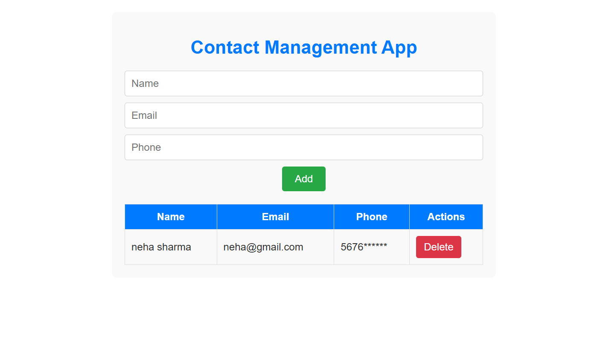

# Contact Management App

A simple and user-friendly React application to manage your contacts efficiently. This app allows you to add, view, and delete contacts with ease. Contacts are persisted in the browser's local storage, so your data remains available even after refreshing or closing the browser.

## Features

- Add new contacts with name, email, and phone number.
- View a list of all saved contacts in a clean tabular format.
- Delete contacts you no longer need.
- Data persistence using localStorage for seamless user experience.
- Responsive and minimalistic user interface.

## Technologies Used

- React 18
- JavaScript (ES6+)
- HTML5 & CSS3
- LocalStorage for data persistence

## Getting Started

### Prerequisites

Make sure you have [Node.js](https://nodejs.org/) installed on your machine.

### Installation

1. Clone the repository or download the source code.
2. Navigate to the project directory in your terminal.
3. Install the dependencies:

```bash
npm install
```

### Running the App

Start the development server with:

```bash
npm start
```

This will launch the app in your default browser at `http://localhost:3000`.

### Building for Production

To create a production build, run:

```bash
npm run build
```

## Project Structure

```
contact-management-app/
├── public/
│   └── index.html          # Main HTML file
├── src/
│   ├── components/
│   │   ├── ContactForm.js  # Form to add new contacts
│   │   └── ContactList.js  # Displays list of contacts with delete option
│   ├── App.js              # Main app component managing state and logic
│   ├── App.css             # Styling for the app
│   └── index.js            # Entry point for React
├── package.json            # Project metadata and dependencies
└── README.md               # Project documentation
```


## Screenshots

Contact Management App : 

## License

This project is open source and free to use.

---

Enjoy managing your contacts effortlessly with this React app!
